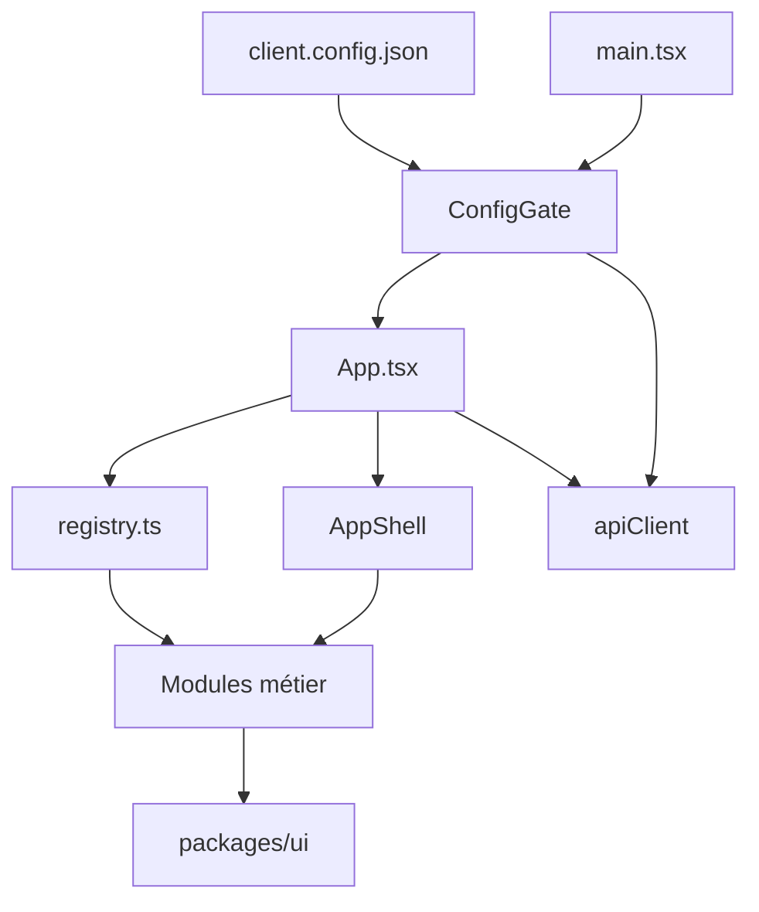

## Architecture – Modular BankUI Studio

Ce document complète le `README.md` et reflète l’état actuel de l’application (100 % TypeScript, sécurité renforcée, session, thèmes).

### Vue d’ensemble

L’objectif est de fournir :

- une **starter app** bancaire modulaire (`apps/starter`) en **TypeScript** (`.ts` / `.tsx`), servant de vitrine et de base de projet,
- un **UI kit** réutilisable (`packages/ui`, exposé en `@bank/ui`), également en TypeScript,
- une configuration client validée via **Zod** et `client.config.json`.

### Structure actuelle du dépôt

```text
banktestapp-main/
├── apps/
│   └── starter/
│       ├── src/
│       │   ├── App.tsx              # Routing modulaire + guards + ConfigGate
│       │   ├── main.tsx             # Bootstrap React + providers (Config, Auth, etc.)
│       │   ├── core/                # Types et constantes partagés
│       │   │   ├── constants.ts    # Rôles, permissions, constantes métier
│       │   │   └── types.ts         # BankModule, BankModuleSidebarItem
│       │   ├── components/          # Composants réutilisables
│       │   │   ├── layout/AppShell.tsx
│       │   │   ├── charts/          # MiniBarChart, MiniLineChart, TrendIndicator
│       │   │   ├── CommandPalette/
│       │   │   ├── ErrorBoundary, LoadingFallback, ModuleLoadingFallback
│       │   │   ├── Breadcrumbs, EmptyState, ConfirmActionModal
│       │   │   ├── SessionTimeoutModal, SessionTimeoutWrapper
│       │   │   ├── ThemeSelector, ThemeToggleIcon, ShortcutHelpModal
│       │   │   └── DemoModeBanner
│       │   ├── lib/                 # Infra : config, auth, API, sécurité, thème
│       │   │   ├── adapters/        # accounts, approvals, audit, dashboard, reports, transactions, usersRoles
│       │   │   ├── api/             # apiClient.ts, apiErrors.ts, useApiClient.ts
│       │   │   ├── auth/            # authProvider, AuthProviderPicker, demoProfileStorage, memoryStore, oidcAuthProvider
│       │   │   ├── config/          # clientConfig.ts, ConfigContext, ConfigGate
│       │   │   ├── security/        # rbac, profilePermissions, SafeHtml, sanitizeHtml
│       │   │   ├── theme/           # ThemeApply, themePreferences
│       │   │   ├── configSchema.ts   # Schéma Zod (parseClientConfig)
│       │   │   ├── useClientConfig.ts, useFeatureFlags.ts, useQuickExport.ts
│       │   │   └── themes.ts
│       │   ├── modules/             # Modules métier (contrat BankModule)
│       │   │   ├── registry.ts      # Enregistrement + getEnabledModules, getSidebarItems, canAccessModule
│       │   │   ├── types.ts         # Réexport BankModule
│       │   │   ├── dashboard/       # module.tsx, types.ts, useDashboardData, DashboardRoleBlock, roleCopy
│       │   │   ├── accounts/       # module.tsx, types.ts
│       │   │   ├── transactions/    # module.tsx, types.ts
│       │   │   ├── approvals/      # module.tsx, types.ts
│       │   │   ├── users-roles/     # module.tsx, types.ts
│       │   │   ├── reports/         # module.tsx, types.ts
│       │   │   └── audit/           # module.tsx, types.ts
│       │   ├── pages/               # Login, LoginCallback, NotFound, Unauthorized, InvalidConfig, NoModules
│       │   └── locales/             # i18n (optionnel)
│       └── public/
│           └── client.config.json   # Branding, modules, api, auth, session
│
├── packages/
│   └── ui/
│       └── src/
│           ├── index.tsx            # Design system (Button, Card, PageLayout, etc.)
│           └── VirtualizedList.tsx
│
├── docs/
│   ├── architecture.md             # Présent document
│   ├── api-contracts.md, security-hardening.md, security-incident-playbook.md
│   ├── en/ et fr/                  # Documentation utilisateur et technique
│   └── ui-accessibility-checklist.md
└── vitest.config.mjs, playwright.config.ts, vite.config.ts
```

### Flux principal



1. **main.tsx** : monte l’app avec les providers (Config, Auth, notifications, etc.).
2. **ConfigGate** : charge et valide `client.config.json` via `configSchema.ts` (Zod) ; en cas d’erreur affiche `InvalidConfigPage`.
3. **App.tsx** : utilise `getEnabledModules(config)` et les permissions (RBAC) pour construire les routes et la sidebar.
4. **AppShell** : layout, navigation, palette de commandes, timeout de session, thème.
5. Chaque **module** expose un contrat `BankModule` (id, name, basePath, routes, sidebarItems, permissionsRequired, featureFlags) et consomme les adaptateurs d’API et `@bank/ui`.

### Contrat de module (BankModule)

Chaque module exporte un objet conforme à l’interface `BankModule` (`core/types.ts`) :

```ts
interface BankModule {
  id: string; // ex: "dashboard"
  name: string; // libellé navigation
  basePath: string; // ex: "/dashboard"
  routes: ComponentType; // composant avec <Routes> internes
  sidebarItems: BankModuleSidebarItem[];
  permissionsRequired?: Permission[];
  featureFlags?: Record<string, boolean>;
  // optionnel : adaptateurs, etc.
}
```

Exemple de structure de module :

```text
apps/starter/src/modules/dashboard/
├── module.tsx        # Contrat BankModule + Routes
├── types.ts          # Types spécifiques au module
├── useDashboardData.ts
├── DashboardRoleBlock.tsx
└── roleCopy.ts
```

Le **registry** (`modules/registry.ts`) :

- centralise tous les modules (dashboard, accounts, transactions, approvals, users-roles, reports, audit),
- expose `getEnabledModules(config)` (filtré par `config.modules.*.enabled`),
- expose `getSidebarItems(config, userPermissions)` (filtré par RBAC),
- expose `canAccessModule(module, permissions)`.

Les **feature flags** par module (ex. `exportEnabled`) sont lus via `useFeatureFlags(moduleId)` qui expose `config.modules[moduleId]`.

### Configuration client et validation

Fichier : `apps/starter/public/client.config.json`.

Exemple (avec session et mode démo) :

```json
{
  "branding": {
    "name": "Ma Banque",
    "logo": "/logo.svg",
    "primaryColor": "#4e0aaf"
  },
  "themeKey": "default",
  "modules": {
    "dashboard": { "enabled": true },
    "accounts": { "enabled": true, "exportEnabled": true },
    "transactions": { "enabled": true, "exportEnabled": true },
    "approvals": { "enabled": true },
    "users-roles": { "enabled": true },
    "reports": { "enabled": true },
    "audit": { "enabled": true }
  },
  "api": {
    "baseUrl": "https://api.mabanque.com",
    "timeout": 8000
  },
  "auth": {
    "type": "oidc",
    "issuer": "https://auth.mabanque.com",
    "clientId": "backoffice-app",
    "mode": "demo"
  },
  "session": {
    "idleTimeoutMinutes": 15,
    "warningBeforeLogoutSeconds": 60
  }
}
```

- **Schéma** : `apps/starter/src/lib/configSchema.ts` définit le schéma Zod ; `parseClientConfig(raw)` valide et retourne la config typée.
- **Typage** : `apps/starter/src/lib/config/clientConfig.ts` expose `ClientConfig`, `BrandingConfig`, `ModulesConfig`, `ApiConfig`, `AuthConfig`, `SessionConfig` et `validateClientConfig(raw)`.
- **ConfigGate** : charge le JSON, appelle la validation ; en échec affiche `InvalidConfigPage`.

### Séparation des responsabilités

- **core/** : types et constantes partagés (BankModule, permissions, rôles). Aucune dépendance aux modules ou à l’UI.
- **modules/** : un dossier par fonctionnalité ; `module.tsx` = contrat + routes ; logique métier dans des hooks (ex. `useDashboardData`) ; pas d’appel API direct dans les vues sans passer par les adaptateurs.
- **lib/adapters/** : couche données ; appels API ou démo ; utilisent `apiClient` (créé à partir de la config). Les erreurs remontent aux modules (message + Réessayer).
- **lib/api/** : `apiClient` (fetch, timeout, rejet vbscript/blob/path malformés), `apiErrors`, `useApiClient`.
- **lib/auth/** : providers (démo vs OIDC), stockage token (memoryStore, demoProfileStorage).
- **lib/config/** : chargement, validation, contexte React (ConfigGate, ConfigContext).
- **lib/security/** : RBAC (`canAccessModule`, `getSidebarItems`), permissions par profil (`profilePermissions`), `SafeHtml` / `sanitizeHtml` pour le contenu riche.
- **lib/theme/** : application du thème (ThemeApply, préférences).
- **components/** : réutilisables, présentiels ou peu de logique ; pas d’appel direct aux adaptateurs. Layout (AppShell), erreurs (ErrorBoundary), chargement (LoadingFallback, ModuleLoadingFallback), session (SessionTimeoutWrapper), thème (ThemeSelector), accessibilité (CommandPalette, ShortcutHelpModal).
- **pages/** : écrans pleine page (Login, LoginCallback, NotFound, Unauthorized, InvalidConfig, NoModules).

### Sécurité (résumé)

- **apiClient** : rejet des URLs avec `vbscript:`, `file:`, `blob:` et chemins contenant `:` pour limiter les risques d’injection.
- **sanitizeHtml** : nettoyage du HTML utilisateur (DOMPurify ou équivalent) ; retour chaîne vide hors navigateur.
- **RBAC** : guards sur routes et sidebar via `permissionsRequired` et `profilePermissions`.
- **Session** : timeout d’inactivité configurable (`session.idleTimeoutMinutes`, `session.warningBeforeLogoutSeconds`) avec avertissement utilisateur.
- **CSP** : conception compatible avec des politiques Content-Security-Policy strictes (voir `docs/security-hardening.md`).

### Tests et qualité

- **Vitest + Testing Library** : tests unitaires et composants (modules, registry, config, RBAC, SafeHtml, sanitizeHtml, apiClient adversarial).
- **Playwright** : E2E (login, dashboard, navigation, sécurité RBAC).
- **ESLint + Prettier** : style de code, appliqué en CI.
- Scripts : `pnpm test`, `pnpm test:e2e`, `pnpm test:security`, `pnpm lint`.

### Créer un nouveau module

1. Créer un dossier sous `apps/starter/src/modules/<id>/` avec au minimum `module.tsx` (et optionnellement `types.ts`, hooks, sous-composants).
2. Implémenter le contrat `BankModule` (id, name, basePath, routes, sidebarItems).
3. Enregistrer le module dans `modules/registry.ts` (import + entrée dans `allModules`).
4. Activer le module dans `client.config.json` (`modules.<id>.enabled: true`).

La doc détaillée des contrats d’API et du design system est dans `docs/api-contracts.md`, `docs/en/` et `docs/fr/` (configuration, modules, accessibilité, intégration entreprise).
