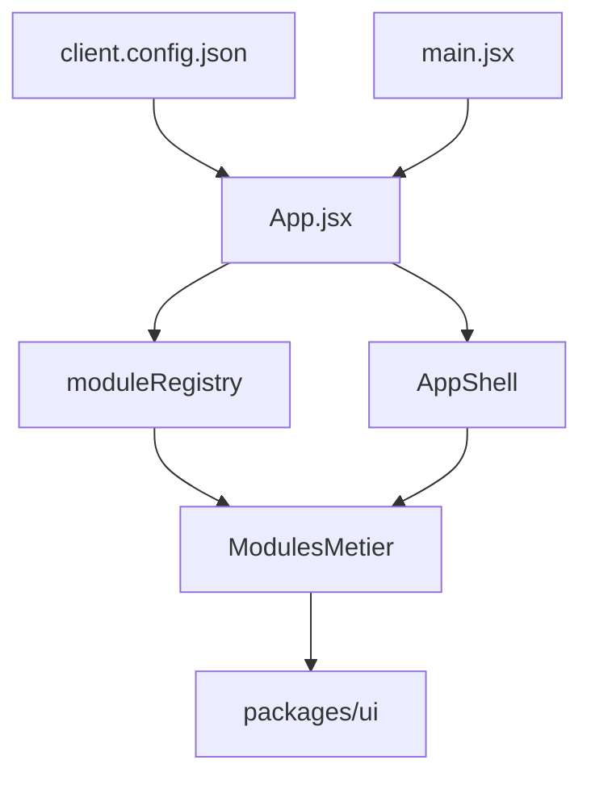

## Architecture – Modular BankUI Studio

Ce document complète le `README.md` et est pensé pour des reviewers techniques (CTO, staff engineer, lead front).

### Vue d’ensemble

L’objectif est de fournir :
- une **starter app** bancaire modulaire (`apps/starter`) servant de vitrine et de base de projet,
- un **UI kit** réutilisable (`packages/ui`, exposé en `@bank/ui`),
- une configuration client simple via `client.config.json`.

```text
banktestapp-main/
├── apps/
│   └── starter/
│       ├── src/
│       │   ├── App.jsx           # Routing modulaire + guards
│       │   ├── main.jsx          # Bootstrap React + providers
│       │   ├── components/       # Layout, ErrorBoundary, Loading, etc.
│       │   ├── modules/          # Modules métier
│       │   ├── lib/              # Auth, RBAC, config client
│       │   └── pages/            # Login, 404, Unauthorized
│       └── public/
│           └── client.config.json
│
├── packages/
│   └── ui/
│       └── src/index.js          # Design system léger (Button, Card, PageLayout, …)
│
├── docs/
│   └── architecture.md           # Présent document
└── vitest.config.mjs / playwright.config.ts / vite.config.*
```

### Flux principal



### Contrat de module

Chaque module exporte un objet de forme :

```js
export default {
  id: "dashboard",          // identifiant unique
  name: "Dashboard",        // libellé dans la navigation
  basePath: "/dashboard",   // préfixe de route
  routes: DashboardRoutes,  // composant contenant les <Routes> internes
  sidebarItems: [
    { label: "Dashboard", to: "/dashboard" },
  ],
};
```

Le `moduleRegistry` :
- centralise les modules connus,
- lit `client.config.json` pour déterminer quels modules sont **activés**,
- expose `getEnabledModules(config?)` utilisé par `AppShell` et le router.

### Contrat de configuration client

`public/client.config.json` :

```json
{
  "branding": {
    "name": "Ma Banque",
    "logo": "/logo.svg",
    "primaryColor": "#4e0aaf"
  },
  "modules": {
    "dashboard": { "enabled": true },
    "accounts": { "enabled": true },
    "transactions": { "enabled": true }
  },
  "api": {
    "baseUrl": "https://api.mabanque.com",
    "timeout": 8000
  },
  "auth": {
    "type": "oidc",
    "issuer": "https://auth.mabanque.com",
    "clientId": "backoffice-app"
  }
}
```

### Points à noter pour reviewers

- **Séparation claire** entre layout, modules métier, infra (auth/RBAC/config) et UI kit.
- **Tests** : Vitest (unitaires/component) et Playwright (E2E smoke) déjà câblés.
- **Extensibilité** : ajout d’un module = créer un dossier dans `modules/` et l’enregistrer dans `moduleRegistry`.
- **Orientation front-only** : aucune dépendance au backend, tous les appels sont supposés passer par des adaptateurs d’API configurables.


