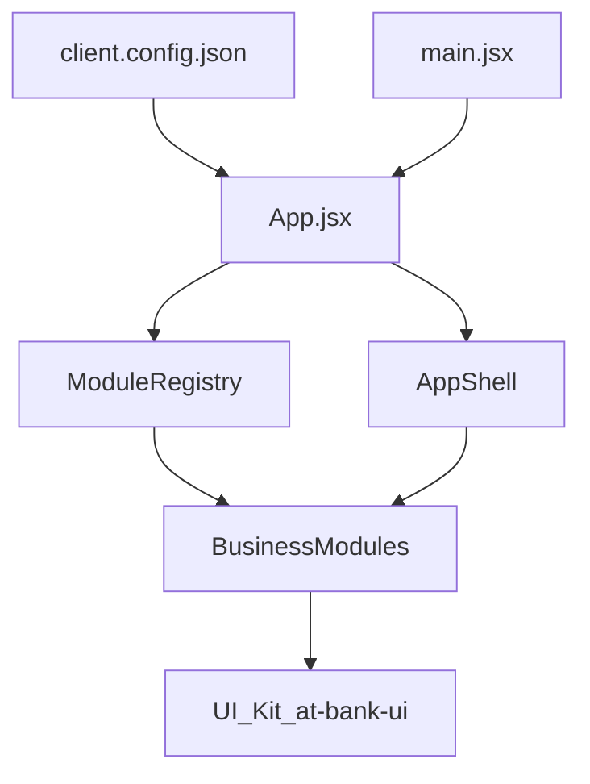

## Architecture

### High‑level goals

- Provide a **modular front‑end** for banking back‑offices.  
- Separate **business modules**, **layout/infrastructure**, and **UI kit**.  
- Allow per‑client configuration without code changes for basic scenarios.

### Repository layout

```text
banktestapp-main/
├── apps/
│   └── starter/
│       ├── src/
│       │   ├── App.jsx           # Modular routing + guards
│       │   ├── main.jsx          # React bootstrap + providers
│       │   ├── components/       # Layout, ErrorBoundary, Loading, etc.
│       │   ├── modules/          # Business feature modules
│       │   ├── lib/              # Auth, RBAC, client config
│       │   └── pages/            # Login, 404, Unauthorized
│       └── public/
│           └── client.config.json
│
├── packages/
│   └── ui/
│       └── src/index.js          # Lightweight design system (@bank/ui)
│
└── vitest.config.mjs / playwright.config.ts / vite.config.*
```

### Main runtime flow



1. `main.jsx` bootstraps React and providers.  
2. `App.jsx` loads `client.config.json`, reads enabled modules via `moduleRegistry`.  
3. `AppShell` renders layout and navigation using the list of enabled modules.  
4. Each module renders its own nested routes and views, consuming `@bank/ui` components.

### Module contract

Each module exports an object with the following shape:

```js
export default {
  id: "dashboard",          // unique identifier
  name: "Dashboard",        // label in navigation
  basePath: "/dashboard",   // route prefix
  routes: DashboardRoutes,  // component with internal <Routes>
  sidebarItems: [
    { label: "Dashboard", to: "/dashboard" },
  ],
};
```

Typical folder structure for a module:

```text
apps/starter/src/modules/limits/
├── module.js        # BankModule contract
└── views/…          # optional specific sub‑pages
```

### Module registry

The `moduleRegistry` is responsible for:

- centralizing known modules,  
- reading `client.config.json` to know which ones are enabled,  
- exposing `getEnabledModules(config?)` for:
  - the router, to compute `<Routes>`,  
  - the layout, to build navigation items.

This allows:

- per‑client and per‑environment configuration (`modules.*.enabled`),  
- easy addition of new modules by:
  - creating a folder under `modules/`,  
  - implementing the module contract,  
  - registering it in the registry.

### Client configuration contract

`public/client.config.json` describes what the app should look like and which modules it should expose:

```json
{
  "branding": {
    "name": "My Bank",
    "logo": "/logo.svg",
    "primaryColor": "#4e0aaf"
  },
  "themeKey": "default",
  "modules": {
    "dashboard": { "enabled": true },
    "accounts": { "enabled": true },
    "transactions": { "enabled": true }
  },
  "api": {
    "baseUrl": "https://api.mybank.com",
    "timeout": 8000
  },
  "auth": {
    "type": "oidc",
    "issuer": "https://auth.mybank.com",
    "clientId": "backoffice-app"
  }
}
```

See `configuration/client-config.md` for a full reference.

### Separation of concerns

- **Layout & shell**  
  - `AppShell`, navigation, header, sidebars, error boundaries.
- **Business modules**  
  - Located in `apps/starter/src/modules/`,  
  - encapsulate their own routing, views and API usage.
- **Infrastructure**  
  - Auth, RBAC, client configuration loading, global error handling.
- **UI kit**  
  - Reusable visual components (`Button`, `Card`, `PageLayout`, etc.) in `@bank/ui`.

This separation lets teams:

- evolve modules independently,  
- share a consistent UI across projects,  
- publish and version the UI kit separately from the starter app.

### Testing & quality hooks

- **Vitest + Testing Library**  
  - component and unit tests (e.g. `App.jsx`, `moduleRegistry`).  
- **Playwright**  
  - E2E smoke tests (login → dashboard).  
- **ESLint + Prettier**  
  - consistent code style, enforced in CI.

See `testing-and-quality.md` for more details.


