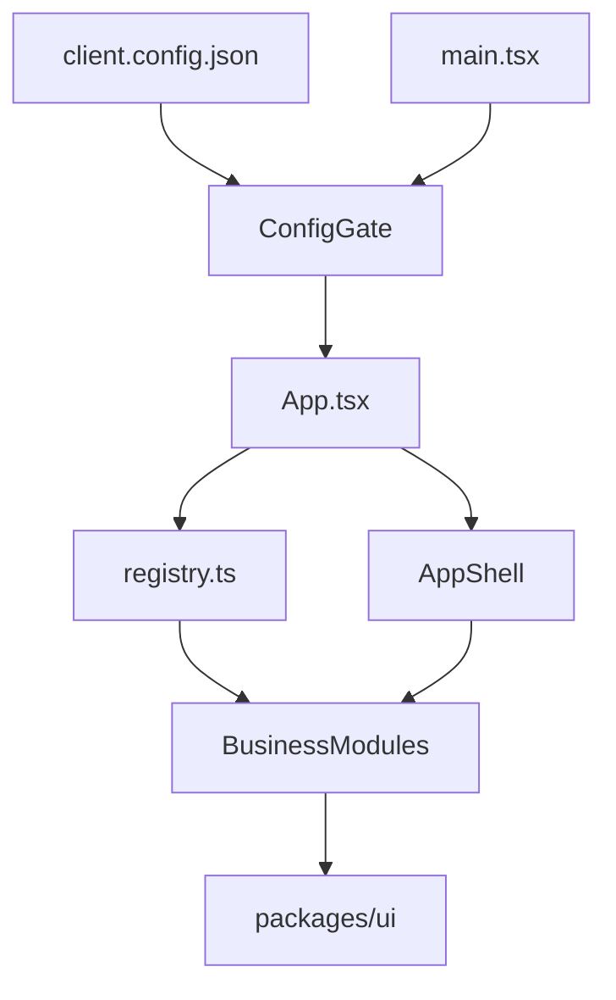

## Architecture

This document reflects the current state of the application: **100% TypeScript**, hardened security, session management, and theming.

### High-level goals

- Provide a **modular front-end** for banking back-offices.
- Separate **business modules**, **layout/infrastructure**, and **UI kit**.
- Allow per-client configuration without code changes (branding, modules, API, auth, session).
- Full **TypeScript** (`.ts` / `.tsx`) for type safety and maintainability.

### Repository layout

```text
banktestapp-main/
├── apps/
│   └── starter/
│       ├── src/
│       │   ├── App.tsx              # Modular routing + guards + ConfigGate
│       │   ├── main.tsx             # React bootstrap + providers
│       │   ├── core/                # Shared types and constants
│       │   │   ├── constants.ts    # Roles, permissions
│       │   │   └── types.ts         # BankModule, BankModuleSidebarItem
│       │   ├── components/          # Reusable components
│       │   │   ├── layout/AppShell.tsx
│       │   │   ├── charts/          # MiniBarChart, MiniLineChart, TrendIndicator
│       │   │   ├── CommandPalette/, ErrorBoundary, LoadingFallback, etc.
│       │   │   ├── SessionTimeoutModal, SessionTimeoutWrapper
│       │   │   ├── ThemeSelector, ThemeToggleIcon, ShortcutHelpModal, DemoModeBanner
│       │   │   └── Breadcrumbs, EmptyState, ConfirmActionModal
│       │   ├── lib/                 # Config, auth, API, security, theme
│       │   │   ├── adapters/        # accounts, approvals, audit, dashboard, reports, transactions, usersRoles
│       │   │   ├── api/             # apiClient.ts, apiErrors.ts, useApiClient.ts
│       │   │   ├── auth/            # authProvider, AuthProviderPicker, demoProfileStorage, memoryStore, oidcAuthProvider
│       │   │   ├── config/          # clientConfig.ts, ConfigContext, ConfigGate
│       │   │   ├── security/        # rbac, profilePermissions, SafeHtml, sanitizeHtml
│       │   │   ├── theme/           # ThemeApply, themePreferences
│       │   │   ├── configSchema.ts   # Zod schema (parseClientConfig)
│       │   │   └── useClientConfig.ts, useFeatureFlags.ts, useQuickExport.ts, themes.ts
│       │   ├── modules/             # Business modules (BankModule contract)
│       │   │   ├── registry.ts      # getEnabledModules, getSidebarItems, canAccessModule
│       │   │   ├── types.ts
│       │   │   ├── dashboard/        # module.tsx, types.ts, useDashboardData, DashboardRoleBlock, roleCopy
│       │   │   ├── accounts/, transactions/, approvals/, users-roles/, reports/, audit/
│       │   ├── pages/               # Login, LoginCallback, NotFound, Unauthorized, InvalidConfig, NoModules
│       │   └── locales/             # i18n (optional)
│       └── public/
│           └── client.config.json   # Branding, modules, api, auth, session
│
├── packages/
│   └── ui/
│       └── src/
│           ├── index.tsx            # Design system (Button, Card, PageLayout, etc.)
│           └── VirtualizedList.tsx
│
└── vitest.config.mjs, playwright.config.ts, vite.config.ts
```

### Main runtime flow



1. **main.tsx** bootstraps React and providers (Config, Auth, notifications).
2. **ConfigGate** loads and validates `client.config.json` via Zod (`configSchema.ts`); on failure shows `InvalidConfigPage`.
3. **App.tsx** uses `getEnabledModules(config)` and RBAC to build routes and sidebar.
4. **AppShell** provides layout, navigation, command palette, session timeout, theme.
5. Each **module** implements the `BankModule` contract and consumes adapters and `@bank/ui`.

### Module contract (BankModule)

Each module exports an object conforming to `BankModule` (`core/types.ts`):

```ts
interface BankModule {
  id: string;
  name: string;
  basePath: string;
  routes: ComponentType;
  sidebarItems: BankModuleSidebarItem[];
  permissionsRequired?: Permission[];
  featureFlags?: Record<string, boolean>;
}
```

Typical folder:

```text
apps/starter/src/modules/dashboard/
├── module.tsx        # BankModule contract + Routes
├── types.ts
├── useDashboardData.ts
├── DashboardRoleBlock.tsx
└── roleCopy.ts
```

The **registry** (`modules/registry.ts`):

- centralizes all modules (dashboard, accounts, transactions, approvals, users-roles, reports, audit),
- exposes `getEnabledModules(config)` (filtered by `config.modules.*.enabled`),
- exposes `getSidebarItems(config, userPermissions)` (filtered by RBAC),
- exposes `canAccessModule(module, permissions)`.

**Feature flags** per module (e.g. `exportEnabled`) are read via `useFeatureFlags(moduleId)`.

### Client configuration

File: `apps/starter/public/client.config.json`. Validated with Zod in `lib/configSchema.ts`; types in `lib/config/clientConfig.ts` (`ClientConfig`, `AuthConfig`, `SessionConfig`, etc.).

Example with session and demo auth:

```json
{
  "branding": {
    "name": "My Bank",
    "logo": "/logo.svg",
    "primaryColor": "#4e0aaf"
  },
  "themeKey": "default",
  "modules": {
    "dashboard": { "enabled": true },
    "accounts": { "enabled": true, "exportEnabled": true },
    "transactions": { "enabled": true },
    "approvals": { "enabled": true },
    "users-roles": { "enabled": true },
    "reports": { "enabled": true },
    "audit": { "enabled": true }
  },
  "api": { "baseUrl": "https://api.mybank.com", "timeout": 8000 },
  "auth": {
    "type": "oidc",
    "issuer": "https://auth.mybank.com",
    "clientId": "backoffice-app",
    "mode": "demo"
  },
  "session": { "idleTimeoutMinutes": 15, "warningBeforeLogoutSeconds": 60 }
}
```

See `configuration/client-config.md` for full reference.

### Separation of concerns

- **core/** – Shared types and constants; no dependency on modules or UI.
- **modules/** – One folder per feature; `module.tsx` = contract + routes; business logic in hooks; data via adapters only.
- **lib/adapters/** – Data layer; API calls or demo data; use `apiClient`.
- **lib/api/** – apiClient (fetch, timeout, safe URL handling), apiErrors, useApiClient.
- **lib/auth/** – Providers (demo vs OIDC), token storage (memoryStore, demoProfileStorage).
- **lib/config/** – Load, validate (Zod), React context (ConfigGate, ConfigContext).
- **lib/security/** – RBAC, profile permissions, SafeHtml, sanitizeHtml.
- **lib/theme/** – Theme application and preferences.
- **components/** – Reusable, presentational; no direct adapter calls.
- **pages/** – Full-page screens (Login, LoginCallback, NotFound, Unauthorized, InvalidConfig, NoModules).

### Security (summary)

- **apiClient**: Rejects URLs with `vbscript:`, `file:`, `blob:` and malformed paths.
- **sanitizeHtml**: Sanitizes user HTML (DOMPurify); empty string outside browser.
- **RBAC**: Route and sidebar guards via `permissionsRequired` and `profilePermissions`.
- **Session**: Configurable idle timeout and warning before logout.
- **CSP**: Designed for strict Content-Security-Policy (see `docs/security-hardening.md`).

### Testing & quality

- **Vitest + Testing Library** – Unit and component tests (modules, registry, config, RBAC, SafeHtml, sanitizeHtml, apiClient).
- **Playwright** – E2E (login, dashboard, navigation, RBAC security).
- **ESLint + Prettier** – Code style, enforced in CI.

See `testing-and-quality.md` for details.
