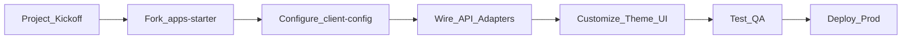

## Enterprise Integration Guide (v1)

### Goal

This guide describes a **typical project journey** to integrate Modular BankUI Studio into a bank or financial institution:

- from initial fork of the starter app,  
- to configuration, theming and API integration,  
- to testing and deployment.

### High‑level journey

### 1. Kickoff & scoping

- Identify target users (ops, back‑office, risk, etc.).  
- Select modules to use initially (Dashboard, Transactions, Users & Roles, Audit).  
- Define integration constraints (IDP, APIs, networks, browsers).

Deliverables:

- list of enabled modules per environment,  
- mapping between roles and modules/actions,  
- list of backend APIs to expose.

### 2. Fork or copy `apps/starter`

- Create a new repository or folder based on `apps/starter`.  
- Keep `packages/ui` as an external dependency (`@bank/ui`) or inline it if needed.

Decide:

- monorepo vs. app‑only repo for your organization,  
- ownership (which team maintains the UI).

### 3. Configure `client.config.json`

- Set branding (name, logo, primary color).  
- Enable modules according to your scope.  
- Configure `api.baseUrl`, `timeout`, and auth provider.

Maintain one config per environment (dev / preprod / prod) and inject the right one at build/deploy time.

### 4. Wire API adapters

- For each module, review the default adapter.  
- Implement client‑specific adapters that:
  - handle your endpoints and payloads,  
  - manage errors, retries and logging according to your standards.

Keep adapter interfaces stable so that views don’t change when backends evolve.

### 5. Customize theme & UI

- Apply your brand guidelines: logos, colors, typography.  
- Optionally define additional `themeKey` presets (e.g. `neo-bank`, `private-banking`).  
- Extend or override module views to better match your workflows.

### 6. Testing & QA

- Run and extend Vitest tests for modules you customize.  
- Add E2E scenarios in Playwright for critical flows:
  - login,  
  - navigation to key modules,  
  - end‑to‑end approval flows on Transactions.

Integrate tests into CI from the beginning.

### 7. Deployment

- Build static assets for `apps/starter`.  
- Deploy behind your reverse proxy or API gateway.  
- Configure:
  - HTTPS and TLS termination,  
  - CSP and security headers,  
  - monitoring (frontend errors, performance metrics).

### Next steps (v2 of this guide)

Future iterations can add:

- patterns for multi‑tenant setups,  
- change‑management processes for UI and modules,  
- monitoring dashboards templates,  
- checklists for audits and pen‑tests.

