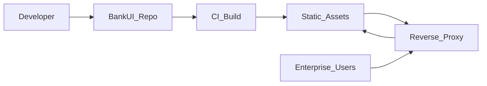

## Getting Started

### Prerequisites

- **Node.js** ≥ 18
- **pnpm** (recommended; npm/yarn also possible with minor script changes)
- Evergreen browsers (Chrome, Firefox, Safari, Edge)

Optional:

- Docker / container registry for deployment
- Reverse proxy or API gateway in front of your backend APIs

### Installation

```bash
# Install dependencies
pnpm install

# Run the demo / starter app
pnpm dev
```

The demo app lives in `apps/starter` (100% TypeScript) and exposes the main feature modules: dashboard, accounts, transactions, approvals, users & roles, reports, audit.

### Project structure (high‑level)

```text
banktestapp-main/
├── apps/
│   └── starter/            # Demo & integration application (TypeScript)
│       ├── src/
│       │   ├── App.tsx, main.tsx
│       │   ├── core/       # Shared types, constants
│       │   ├── pages/      # Login, LoginCallback, 404, Unauthorized, InvalidConfig, NoModules
│       │   ├── modules/    # Business modules (registry.ts + dashboard, accounts, transactions, etc.)
│       │   ├── components/ # AppShell, ErrorBoundary, Loading, SessionTimeout, ThemeSelector, etc.
│       │   └── lib/        # Auth, config (ConfigGate), API, security, theme, adapters
│       └── public/
│           └── client.config.json # Per‑client configuration (branding, modules, api, auth, session)
│
├── packages/
│   └── ui/                 # Reusable UI library (@bank/ui), TypeScript
│       └── src/
│           ├── index.tsx
│           └── VirtualizedList.tsx
│
├── vite.config.ts / vitest.config.mjs / playwright.config.ts
└── package.json / pnpm-workspace.yaml
```

- `apps/starter`: what you typically fork or copy for a client project.
- `packages/ui`: what you can publish as `@bank/ui` to your registry.

### Running in development

```bash
# Start the starter app (apps/starter)
pnpm dev

# Run unit/component tests
pnpm test

# Run E2E tests (Playwright)
pnpm test:e2e

# Run security-focused tests
pnpm test:security
```

Open the app in your browser, log in using the configured auth provider, and explore modules like Dashboard and Transactions.

### Building for production

```bash
# Global production build (UI + apps)
pnpm build

# Build UI package only
pnpm -F @bank/ui build

# Build the starter app only
cd apps/starter
pnpm build
```

The starter app build outputs static assets in `apps/starter/dist/` which you can serve behind your reverse proxy or API gateway.

### First‑time configuration (`client.config.json`)

Before going to production, you should:

1. Copy `apps/starter/public/client.config.json` and adapt it per environment (dev, preprod, prod).
2. Adjust:
   - `branding`: bank name, logo, primary color;
   - `themeKey`: base theme (e.g. default);
   - `modules`: which modules are enabled (dashboard, accounts, transactions, approvals, users-roles, reports, audit);
   - `api`: base URL and timeouts;
   - `auth`: OIDC or demo mode (`mode`: `"demo"` or `"oidc"`);
   - `session`: optional `idleTimeoutMinutes`, `warningBeforeLogoutSeconds`.

See `configuration/client-config.md` for a full reference.

### Quick checklist for IT / Ops

- [ ] Node.js ≥ 18 available in CI/CD
- [ ] Build pipeline runs `pnpm install` then `pnpm build`
- [ ] Static files from `apps/starter/dist/` are deployed behind a reverse proxy
- [ ] `client.config.json` is versioned or templated per environment
- [ ] CSP and security headers configured according to your policies
- [ ] Monitoring / logging of frontend errors wired to your observability stack


