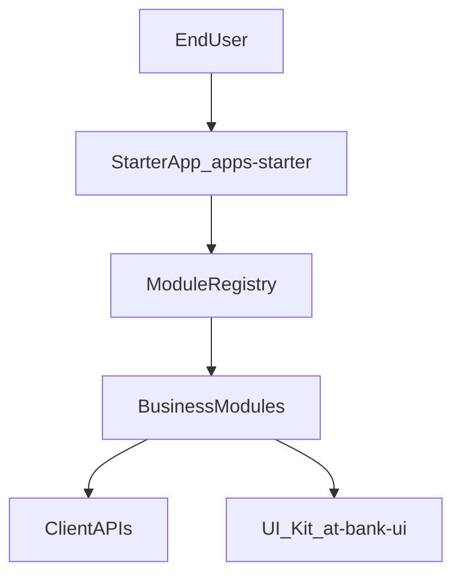

## Modular BankUI Studio – Product & Technical Overview

### What is Modular BankUI Studio?

Modular BankUI Studio is a **front‑end only**, modular back‑office UI suite for banking and financial use cases.

- 100% front‑end: no backend in this repository, you wire your own APIs.
- Modular: enable/disable business modules (Dashboard, Transactions, Users & Roles, Audit, and your own).
- Brandable: per‑client theming (logo, colors, design tokens).
- Enterprise‑ready focus: RBAC, audit, performance, accessibility (WCAG 2.1 AA).

This project is designed as a **portfolio‑grade showcase** and as a **starter kit** for real‑world enterprise integrations:

- clean modular architecture,
- clear separation of concerns,
- tests and documentation ready for technical reviews (CTO, staff engineers, leads).

### Personas & target users

#### 1. Integration developers (front‑end / back‑end)

**Goal**: fork or reuse `apps/starter`, plug into existing APIs, add/modify business modules.

They care about:

- how modules are wired and discovered (`moduleRegistry`, `client.config.json`),
- how to add a new module with its routes and navigation,
- how to implement and override API adapters per client,
- how to keep code tested, maintainable, and aligned with enterprise constraints.

#### 2. IT / Ops / Platform teams

**Goal**: deploy, configure, and operate the UI in bank environments.

They care about:

- build and deployment process (static assets, reverse proxy / gateway),
- environment‑specific configuration (`client.config.json` per env),
- security posture (tokens, CSP, logs),
- observability and monitoring hooks.

#### 3. Product owners & business stakeholders

**Goal**: understand what each module does and how it supports banking operations.

They care about:

- which modules exist and what problems they solve,
- how the UI can be tailored to their processes (roles, workflows, branding),
- what remains up to backend and internal systems (compliance, KYC/AML, risk).

### High‑level architecture

At a high level, Modular BankUI Studio provides:

- a **starter app** `apps/starter` as demo and integration base,
- a reusable **UI kit** in `packages/ui` exposed as `@bank/ui`,
- a **client configuration file** `public/client.config.json` to control branding, modules, and API settings.



### How modules work

Each business module exports a **module contract**:

```js
export default {
  id: "dashboard",
  name: "Dashboard",
  basePath: "/dashboard",
  routes: DashboardRoutes,
  sidebarItems: [
    { label: "Dashboard", to: "/dashboard" },
  ],
};
```

The `moduleRegistry`:

- centralizes all known modules,
- reads `client.config.json` to determine which modules are **enabled**,
- exposes `getEnabledModules(config?)` for the router and the application shell.

This allows you to:

- add new modules by creating a new folder and registering it,
- enable/disable modules per environment or per client,
- keep navigation and routing consistent.

### What you can customize

- **Branding & theming**: name, logo, primary color, and theming tokens.
- **Modules**: enable or disable modules; add your own.
- **API adapters**: replace the default REST‑style adapters by client‑specific ones.
- **Access control**: integrate with your IAM / IDP and wire RBAC at module and route level.
- **UX**: extend or replace views inside each module while reusing the shared UI kit.

### Where to go next

- For installation and environment setup, see `getting-started.md`.
- For a deeper architecture view, see `architecture.md`.
- For details about each feature module, see the files under `modules/`.
- For configuration and APIs, see `configuration/client-config.md` and `configuration/api-adapters.md`.
- For security, accessibility, performance, and testing, see the dedicated guides.
- For a full enterprise integration journey, see `enterprise-integration-guide.md`.


