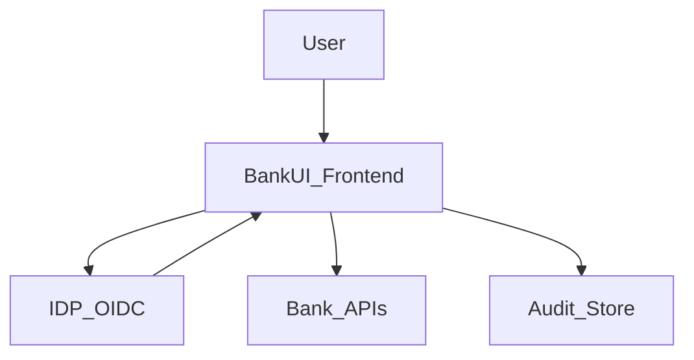

## Security & Compliance

### Scope

Modular BankUI Studio is **front‑end only**:  
business rules, data protection and regulatory compliance (KYC/AML, GDPR, etc.) remain on your backend.  
The UI is designed to:

- avoid introducing new attack surfaces,
- apply good security hygiene on the client side,
- integrate cleanly with your existing security stack.

### Front‑end security principles

- **Tokens in memory only** by default (no long‑term storage).
- **CSP‑friendly**: compatible with strict Content Security Policy setups.
- **RBAC**: routes and components are protected by role/permission guards.
- **No PII in logs** by default.
- **Sanitization** of any rich content (e.g. with DOMPurify).

In the starter app:

- a **minimal CSP** is defined in `apps/starter/index.html` (meta `Content-Security-Policy`).
- a `sanitizeHtml` helper (`apps/starter/src/lib/security/sanitizeHtml.ts`) wraps DOMPurify for any content coming from `client.config.json` or other external sources.

### Typical security architecture

Backends:

- authenticate users (IDP / IAM),
- authorize actions (RBAC/ABAC on APIs),
- store all sensitive data.

Frontend:

- uses ID tokens / access tokens to call APIs,
- hides or disables UI based on roles/permissions.

### Demo vs production

The starter app includes **demo-only mechanisms** (see code comments):

- **Auth**: depending on `auth.mode` in `client.config.json`: `"demo"` uses `AuthProvider` and `demoProfileStorage` (profile in `localStorage`); `"oidc"` uses `OidcAuthProvider` (IDP redirect, tokens in memory via `memoryStore`).
- **RBAC**: permissions are derived on the client from the demo profile.

In **production**, you must:

- replace auth with an **IDP-driven flow** (OIDC, SAML) and tokens;
- enforce **RBAC on the backend** (every API call must be authorized by the server);
- ensure **action audit** on the server (not only via the front Audit module).

**Explicit production requirements:**

- **No profile or roles in `localStorage`**: the `demo-profile` storage is for demo only. In production, authentication and roles must come from an **IDP/backend** (signed tokens, server session). Never reuse this demo mechanism in prod.
- **Access tokens in memory only**: keep access tokens in application context (e.g. React state / memory), not in `localStorage` or `sessionStorage`, to reduce exposure in case of XSS. If using refresh tokens, prefer httpOnly cookies.
- **IDP/backend required**: the front app must not decide roles or permissions on its own; every sensitive business call must be authorized by the backend.

See also `docs/security-hardening.md` and the enterprise integration guide (`docs/en/enterprise-integration-guide.md`).

### Checklist – secure integration

**Auth & sessions**

- [ ] Use a well‑maintained OIDC/OAuth library.
- [ ] Keep tokens in memory or short‑lived storage only.
- [ ] Implement logout / token revocation flows.
- [ ] Avoid persisting sensitive tokens in `localStorage` unless risk‑assessed.

**Network & CSP**

- [ ] Enforce HTTPS everywhere.
- [ ] Configure CSP to restrict scripts, styles and connections.
- [ ] Restrict allowed origins for APIs and IDP.

**Logs & analytics**

- [ ] Do not log PII from the frontend.
- [ ] Use correlation IDs rather than customer identifiers.
- [ ] Forward errors to your observability stack with minimal context.

**RBAC & guards**

- [ ] Define a clear permission model (per module/action).
- [ ] Use guards on routes and critical components.
- [ ] Never rely on front‑end checks only; always enforce on the backend too.

### Compliance considerations

The UI can support:

- access logging and audit (via the Audit module),
- transparency to users (e.g. where data comes from),
- segregation of duties (by combining modules and roles).

Formal regulatory compliance is out of scope of this repo and must be implemented in your backend and processes.
