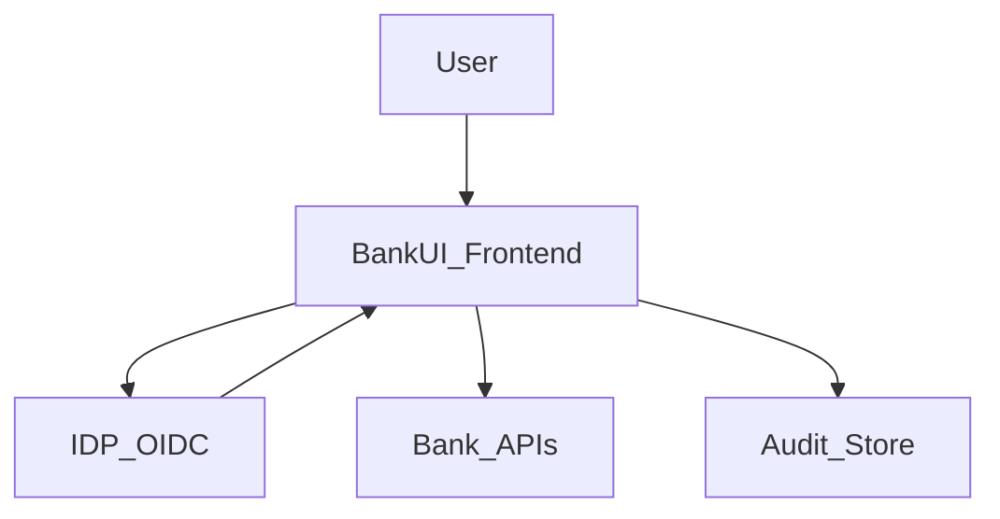

## Security & Compliance

### Scope

Modular BankUI Studio is **front‑end only**:  
business rules, data protection and regulatory compliance (KYC/AML, GDPR, etc.) remain on your backend.  
The UI is designed to:

- avoid introducing new attack surfaces,  
- apply good security hygiene on the client side,  
- integrate cleanly with your existing security stack.

### Front‑end security principles

- **Tokens in memory only** by default (no long‑term storage).  
- **CSP‑friendly**: compatible with strict Content Security Policy setups.  
- **RBAC**: routes and components are protected by role/permission guards.  
- **No PII in logs** by default.  
- **Sanitization** of any rich content (e.g. with DOMPurify).

### Typical security architecture

Backends:

- authenticate users (IDP / IAM),  
- authorize actions (RBAC/ABAC on APIs),  
- store all sensitive data.

Frontend:

- uses ID tokens / access tokens to call APIs,  
- hides or disables UI based on roles/permissions.

### Checklist – secure integration

**Auth & sessions**

- [ ] Use a well‑maintained OIDC/OAuth library.  
- [ ] Keep tokens in memory or short‑lived storage only.  
- [ ] Implement logout / token revocation flows.  
- [ ] Avoid persisting sensitive tokens in `localStorage` unless risk‑assessed.

**Network & CSP**

- [ ] Enforce HTTPS everywhere.  
- [ ] Configure CSP to restrict scripts, styles and connections.  
- [ ] Restrict allowed origins for APIs and IDP.

**Logs & analytics**

- [ ] Do not log PII from the frontend.  
- [ ] Use correlation IDs rather than customer identifiers.  
- [ ] Forward errors to your observability stack with minimal context.

**RBAC & guards**

- [ ] Define a clear permission model (per module/action).  
- [ ] Use guards on routes and critical components.  
- [ ] Never rely on front‑end checks only; always enforce on the backend too.

### Compliance considerations

The UI can support:

- access logging and audit (via the Audit module),  
- transparency to users (e.g. where data comes from),  
- segregation of duties (by combining modules and roles).

Formal regulatory compliance is out of scope of this repo and must be implemented in your backend and processes.

