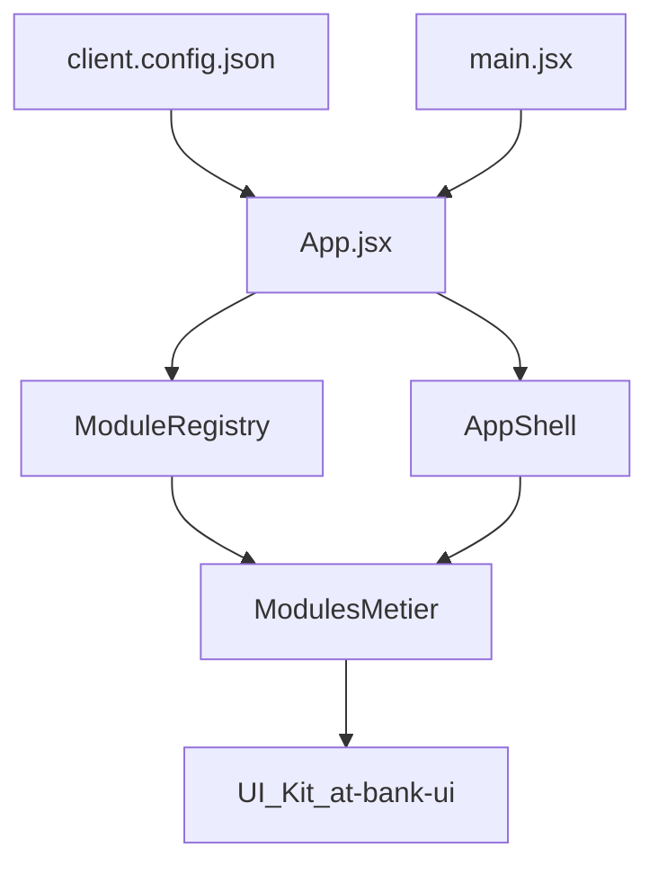

## Architecture

### Objectifs principaux

- Fournir un **front‑end modulaire** pour les back‑offices bancaires.  
- Séparer clairement **modules métier**, **layout/infra** et **UI kit**.  
- Permettre une configuration par client sans changement de code pour les cas simples.

### Structure du dépôt

```text
banktestapp-main/
├── apps/
│   └── starter/
│       ├── src/
│       │   ├── App.jsx           # Routing modulaire + guards
│       │   ├── main.jsx          # Bootstrap React + providers
│       │   ├── components/       # Layout, ErrorBoundary, Loading, etc.
│       │   ├── modules/          # Modules métier
│       │   ├── lib/              # Auth, RBAC, config client
│       │   └── pages/            # Login, 404, Unauthorized
│       └── public/
│           └── client.config.json
│
├── packages/
│   └── ui/
│       └── src/index.js          # Design system léger (@bank/ui)
│
└── vitest.config.mjs / playwright.config.ts / vite.config.*
```

### Flux principal à l’exécution



1. `main.jsx` initialise React et les providers.  
2. `App.jsx` charge `client.config.json`, lit les modules activés via `moduleRegistry`.  
3. `AppShell` affiche le layout et la navigation à partir de la liste de modules activés.  
4. Chaque module gère ses propres routes et vues, en consommant les composants de `@bank/ui`.

### Contrat de module

Chaque module exporte un objet de forme :

```js
export default {
  id: "dashboard",          // identifiant unique
  name: "Dashboard",        // libellé dans la navigation
  basePath: "/dashboard",   // préfixe de route
  routes: DashboardRoutes,  // composant contenant les <Routes> internes
  sidebarItems: [
    { label: "Dashboard", to: "/dashboard" },
  ],
};
```

Structure typique d’un module :

```text
apps/starter/src/modules/limits/
├── module.js        # Contrat BankModule
└── views/…          # Sous‑pages spécifiques (optionnel)
```

### Module registry

Le `moduleRegistry` a pour rôle de :

- centraliser les modules connus,  
- lire `client.config.json` pour savoir lesquels sont activés,  
- exposer `getEnabledModules(config?)` pour :
  - le routeur (construction des `<Routes>`),  
  - le layout (construction de la navigation).

Conséquences :

- configuration par client / environnement (`modules.*.enabled`),  
- ajout d’un module par :
  - création du dossier dans `modules/`,  
  - implémentation du contrat,  
  - enregistrement dans le registry.

### Contrat de configuration client

`public/client.config.json` décrit la configuration de l’app :

```json
{
  "branding": {
    "name": "Ma Banque",
    "logo": "/logo.svg",
    "primaryColor": "#4e0aaf"
  },
  "themeKey": "default",
  "modules": {
    "dashboard": { "enabled": true },
    "accounts": { "enabled": true },
    "transactions": { "enabled": true }
  },
  "api": {
    "baseUrl": "https://api.mabanque.com",
    "timeout": 8000
  },
  "auth": {
    "type": "oidc",
    "issuer": "https://auth.mabanque.com",
    "clientId": "backoffice-app"
  }
}
```

La référence complète est détaillée dans `configuration/client-config.md`.

### Séparation des responsabilités

- **Layout & shell**  
  - `AppShell`, navigation, header, sidebars, error boundaries.
- **Modules métier**  
  - localisés dans `apps/starter/src/modules/`,  
  - encapsulent leur routing, leurs vues et leur consommation d’API.
- **Infrastructure**  
  - Auth, RBAC, chargement de la config client, gestion globale des erreurs.
- **UI kit**  
  - Composants visuels réutilisables (`Button`, `Card`, `PageLayout`, etc.) dans `@bank/ui`.

Cette séparation permet :

- de faire évoluer les modules indépendamment,  
- de partager une UI cohérente entre projets,  
- de publier/versionner le UI kit séparément de l’app starter.

### Points d’ancrage qualité & tests

- **Vitest + Testing Library**  
  - tests components et unitaires (par ex. `App.jsx`, `moduleRegistry`).  
- **Playwright**  
  - tests E2E smoke (login → dashboard).  
- **ESLint + Prettier**  
  - style de code cohérent, appliqué en CI.

Voir `testing-and-quality.md` pour plus de détails.


