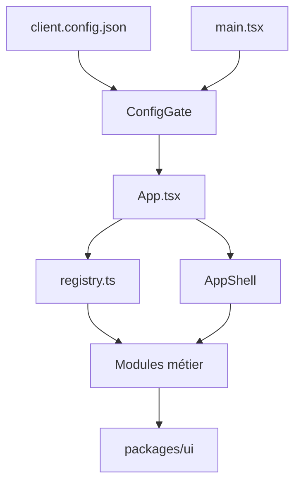

## Architecture

Ce document reflète l’état actuel de l’application : **100 % TypeScript**, sécurité renforcée, gestion de session et thèmes.

### Objectifs principaux

- Fournir un **front-end modulaire** pour les back-offices bancaires.
- Séparer **modules métier**, **layout/infra** et **UI kit**.
- Permettre une configuration par client sans changement de code (branding, modules, API, auth, session).
- **100 % TypeScript** (`.ts` / `.tsx`) pour la robustesse et la maintenabilité.

### Structure du dépôt

```text
banktestapp-main/
├── apps/
│   └── starter/
│       ├── src/
│       │   ├── App.tsx              # Routing modulaire + guards + ConfigGate
│       │   ├── main.tsx             # Bootstrap React + providers
│       │   ├── core/                # Types et constantes partagés
│       │   │   ├── constants.ts    # Rôles, permissions
│       │   │   └── types.ts         # BankModule, BankModuleSidebarItem
│       │   ├── components/          # Composants réutilisables
│       │   │   ├── layout/AppShell.tsx
│       │   │   ├── charts/          # MiniBarChart, MiniLineChart, TrendIndicator
│       │   │   ├── CommandPalette/, ErrorBoundary, LoadingFallback, etc.
│       │   │   ├── SessionTimeoutModal, SessionTimeoutWrapper
│       │   │   ├── ThemeSelector, ThemeToggleIcon, ShortcutHelpModal, DemoModeBanner
│       │   │   └── Breadcrumbs, EmptyState, ConfirmActionModal
│       │   ├── lib/                 # Config, auth, API, sécurité, thème
│       │   │   ├── adapters/        # accounts, approvals, audit, dashboard, reports, transactions, usersRoles
│       │   │   ├── api/             # apiClient.ts, apiErrors.ts, useApiClient.ts
│       │   │   ├── auth/            # authProvider, AuthProviderPicker, demoProfileStorage, memoryStore, oidcAuthProvider
│       │   │   ├── config/          # clientConfig.ts, ConfigContext, ConfigGate
│       │   │   ├── security/        # rbac, profilePermissions, SafeHtml, sanitizeHtml
│       │   │   ├── theme/           # ThemeApply, themePreferences
│       │   │   ├── configSchema.ts   # Schéma Zod (parseClientConfig)
│       │   │   └── useClientConfig.ts, useFeatureFlags.ts, useQuickExport.ts, themes.ts
│       │   ├── modules/             # Modules métier (contrat BankModule)
│       │   │   ├── registry.ts      # getEnabledModules, getSidebarItems, canAccessModule
│       │   │   ├── types.ts
│       │   │   ├── dashboard/        # module.tsx, types.ts, useDashboardData, DashboardRoleBlock, roleCopy
│       │   │   ├── accounts/, transactions/, approvals/, users-roles/, reports/, audit/
│       │   ├── pages/               # Login, LoginCallback, NotFound, Unauthorized, InvalidConfig, NoModules
│       │   └── locales/             # i18n (optionnel)
│       └── public/
│           └── client.config.json   # Branding, modules, api, auth, session
│
├── packages/
│   └── ui/
│       └── src/
│           ├── index.tsx            # Design system (Button, Card, PageLayout, etc.)
│           └── VirtualizedList.tsx
│
└── vitest.config.mjs, playwright.config.ts, vite.config.ts
```

### Flux principal à l’exécution



1. **main.tsx** initialise React et les providers (Config, Auth, notifications).
2. **ConfigGate** charge et valide `client.config.json` via Zod (`configSchema.ts`) ; en échec affiche `InvalidConfigPage`.
3. **App.tsx** utilise `getEnabledModules(config)` et le RBAC pour construire les routes et la sidebar.
4. **AppShell** fournit le layout, la navigation, la palette de commandes, le timeout de session, le thème.
5. Chaque **module** implémente le contrat `BankModule` et consomme les adaptateurs et `@bank/ui`.

### Contrat de module (BankModule)

Chaque module exporte un objet conforme à `BankModule` (`core/types.ts`) :

```ts
interface BankModule {
  id: string;
  name: string;
  basePath: string;
  routes: ComponentType;
  sidebarItems: BankModuleSidebarItem[];
  permissionsRequired?: Permission[];
  featureFlags?: Record<string, boolean>;
}
```

Structure typique :

```text
apps/starter/src/modules/dashboard/
├── module.tsx        # Contrat BankModule + Routes
├── types.ts
├── useDashboardData.ts
├── DashboardRoleBlock.tsx
└── roleCopy.ts
```

Le **registry** (`modules/registry.ts`) :

- centralise tous les modules (dashboard, accounts, transactions, approvals, users-roles, reports, audit),
- expose `getEnabledModules(config)` (filtré par `config.modules.*.enabled`),
- expose `getSidebarItems(config, userPermissions)` (filtré par RBAC),
- expose `canAccessModule(module, permissions)`.

Les **feature flags** par module (ex. `exportEnabled`) sont lus via `useFeatureFlags(moduleId)`.

### Configuration client

Fichier : `apps/starter/public/client.config.json`. Validée avec Zod dans `lib/configSchema.ts` ; types dans `lib/config/clientConfig.ts` (`ClientConfig`, `AuthConfig`, `SessionConfig`, etc.).

Exemple avec session et auth démo :

```json
{
  "branding": {
    "name": "Ma Banque",
    "logo": "/logo.svg",
    "primaryColor": "#4e0aaf"
  },
  "themeKey": "default",
  "modules": {
    "dashboard": { "enabled": true },
    "accounts": { "enabled": true, "exportEnabled": true },
    "transactions": { "enabled": true },
    "approvals": { "enabled": true },
    "users-roles": { "enabled": true },
    "reports": { "enabled": true },
    "audit": { "enabled": true }
  },
  "api": { "baseUrl": "https://api.mabanque.com", "timeout": 8000 },
  "auth": {
    "type": "oidc",
    "issuer": "https://auth.mabanque.com",
    "clientId": "backoffice-app",
    "mode": "demo"
  },
  "session": { "idleTimeoutMinutes": 15, "warningBeforeLogoutSeconds": 60 }
}
```

Référence complète : `configuration/client-config.md`.

### Séparation des responsabilités

- **core/** – Types et constantes partagés ; aucune dépendance aux modules ou à l’UI.
- **modules/** – Un dossier par fonctionnalité ; `module.tsx` = contrat + routes ; logique dans des hooks ; données via adaptateurs uniquement.
- **lib/adapters/** – Couche données ; appels API ou démo ; utilisation de `apiClient`.
- **lib/api/** – apiClient (fetch, timeout, URLs sécurisées), apiErrors, useApiClient.
- **lib/auth/** – Providers (démo vs OIDC), stockage token (memoryStore, demoProfileStorage).
- **lib/config/** – Chargement, validation (Zod), contexte React (ConfigGate, ConfigContext).
- **lib/security/** – RBAC, permissions par profil, SafeHtml, sanitizeHtml.
- **lib/theme/** – Application du thème et préférences.
- **components/** – Réutilisables, présentiels ; pas d’appel direct aux adaptateurs.
- **pages/** – Écrans pleine page (Login, LoginCallback, NotFound, Unauthorized, InvalidConfig, NoModules).

### Sécurité (résumé)

- **apiClient** : rejet des URLs `vbscript:`, `file:`, `blob:` et chemins malformés.
- **sanitizeHtml** : nettoyage du HTML utilisateur ; chaîne vide hors navigateur.
- **RBAC** : guards sur routes et sidebar via `permissionsRequired` et `profilePermissions`.
- **Session** : timeout d’inactivité et avertissement avant déconnexion configurables.
- **CSP** : compatible avec des politiques Content-Security-Policy strictes (voir `docs/security-hardening.md`).

### Qualité & tests

- **Vitest + Testing Library** – Tests unitaires et composants (modules, registry, config, RBAC, SafeHtml, sanitizeHtml, apiClient).
- **Playwright** – E2E (login, dashboard, navigation, sécurité RBAC).
- **ESLint + Prettier** – Style de code, appliqué en CI.

Voir `testing-and-quality.md` pour plus de détails.
