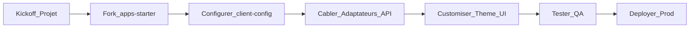

## Guide d’intégration en entreprise (v1)

### Objectif

Ce guide décrit un **parcours projet type** pour intégrer Modular BankUI Studio dans une banque ou une institution financière :

- du fork initial de l’app starter,  
- à la configuration, au theming et au câblage des APIs,  
- jusqu’aux tests et au déploiement.

### Parcours global

### 1. Kickoff & cadrage

- Identifier les utilisateurs cibles (ops, back‑office, risques, etc.).  
- Sélectionner les modules à utiliser en phase 1 (Dashboard, Transactions, Users & Roles, Audit).  
- Poser les contraintes d’intégration (IDP, APIs, réseaux, navigateurs).

Livrables :

- liste des modules activés par environnement,  
- mapping rôles ↔ modules/actions,  
- liste des APIs backend à exposer.

### 2. Fork ou copie de `apps/starter`

- Créer un nouveau repo ou dossier à partir de `apps/starter`.  
- Garder `packages/ui` comme dépendance externe (`@bank/ui`) ou l’embarquer si besoin.

Décisions :

- monorepo vs repo dédié app pour votre organisation,  
- équipe propriétaire de l’UI (ownership).

### 3. Configuration de `client.config.json`

- Renseigner le branding (nom, logo, couleur principale).  
- Activer les modules selon le cadrage.  
- Configurer `api.baseUrl`, `timeout` et le provider d’authentification.

Maintenir une config par environnement (dev / préprod / prod) et injecter la bonne version au build / déploiement.

### 4. Câblage des adaptateurs d’API

- Pour chaque module, revoir l’adaptateur par défaut.  
- Implémenter des adaptateurs spécifiques client qui :
  - gèrent vos endpoints et payloads,  
  - appliquent vos règles d’erreur, retries et logging.

Garder les interfaces d’adaptateurs stables pour éviter de modifier les vues lorsque les backends évoluent.

### 5. Customisation du thème & de l’UI

- Appliquer votre charte : logos, couleurs, typographie.  
- Définir éventuellement des presets `themeKey` (ex. `neo-bank`, `private-banking`).  
- Étendre ou surcharger les vues des modules pour coller à vos workflows.

### 6. Tests & QA

- Lancer et étendre les tests Vitest sur les modules que vous personnalisez.  
- Ajouter des scénarios E2E Playwright pour les parcours critiques :
  - login,  
  - navigation vers les modules clés,  
  - parcours d’approbation bout‑en‑bout sur Transactions.

Intégrer les tests dans la CI dès le début.

### 7. Déploiement

- Builder les assets statiques de `apps/starter`.  
- Déployer derrière votre reverse proxy ou API gateway.  
- Configurer :
  - HTTPS et terminaison TLS,  
  - CSP et en‑têtes de sécurité,  
  - monitoring (erreurs front, métriques de performance).

### Prochaines étapes (v2 de ce guide)

Les itérations futures pourront ajouter :

- des patterns pour les setups multi‑tenants,  
- des processus de gestion de changement pour l’UI et les modules,  
- des templates de dashboards de monitoring,  
- des checklists pour audits et tests d’intrusion.

