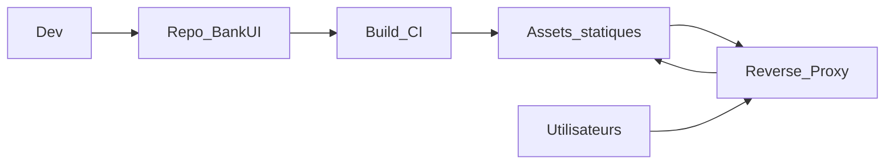

## Prise en main

### Prérequis

- **Node.js** ≥ 18
- **pnpm** (recommandé ; npm/yarn possibles avec quelques ajustements de scripts)
- Navigateurs evergreen (Chrome, Firefox, Safari, Edge)

Optionnel :

- Docker / registry pour le déploiement
- Reverse proxy ou API gateway devant vos APIs backend

### Installation

```bash
# Installer les dépendances
pnpm install

# Lancer l’application de démo / starter
pnpm dev
```

L’application de démo vit dans `apps/starter` (100 % TypeScript) et expose les modules : dashboard, accounts, transactions, approvals, users & roles, reports, audit.

### Structure du projet (vue globale)

```text
banktestapp-main/
├── apps/
│   └── starter/            # Application de démo & base d’intégration (TypeScript)
│       ├── src/
│       │   ├── App.tsx, main.tsx
│       │   ├── core/       # Types et constantes partagés
│       │   ├── pages/      # Login, LoginCallback, 404, Unauthorized, InvalidConfig, NoModules
│       │   ├── modules/    # Modules métier (registry.ts + dashboard, accounts, transactions, etc.)
│       │   ├── components/ # AppShell, ErrorBoundary, Loading, SessionTimeout, ThemeSelector, etc.
│       │   └── lib/        # Auth, config (ConfigGate), API, sécurité, thème, adaptateurs
│       └── public/
│           └── client.config.json # Configuration client (branding, modules, api, auth, session)
│
├── packages/
│   └── ui/                 # Librairie UI réutilisable (@bank/ui), TypeScript
│       └── src/
│           ├── index.tsx
│           └── VirtualizedList.tsx
│
├── vite.config.ts / vitest.config.mjs / playwright.config.ts
└── package.json / pnpm-workspace.yaml
```

- `apps/starter` : ce que vous allez typiquement forker ou copier pour un projet client.
- `packages/ui` : ce que vous pouvez publier en `@bank/ui` sur votre registry.

### Lancer en développement

```bash
# Démarrer l’app starter (apps/starter)
pnpm dev

# Tests unitaires / components
pnpm test

# Tests E2E (Playwright)
pnpm test:e2e

# Tests orientés sécurité
pnpm test:security
```

Vous pouvez ensuite ouvrir l’application dans votre navigateur, vous connecter via le provider d’authentification configuré, et explorer les modules comme Dashboard ou Transactions.

### Build pour la production

```bash
# Build production global (UI + apps)
pnpm build

# Build du package UI uniquement
pnpm -F @bank/ui build

# Build de l’app starter uniquement
cd apps/starter
pnpm build
```

Le build de l’app starter produit des assets statiques dans `apps/starter/dist/` que vous pouvez servir derrière votre reverse proxy ou API gateway.

### Première configuration (`client.config.json`)

Avant un déploiement réel, il est conseillé de :

1. Copier `apps/starter/public/client.config.json` et l’adapter par environnement (dev, préprod, prod).
2. Ajuster :
   - `branding` : nom de la banque, logo, couleur principale ;
   - `themeKey` : thème de base (ex. default) ;
   - `modules` : quels modules sont activés (dashboard, accounts, transactions, approvals, users-roles, reports, audit) ;
   - `api` : base URL et timeouts ;
   - `auth` : mode OIDC ou démo (`mode` : `"demo"` ou `"oidc"`) ;
   - `session` : optionnel `idleTimeoutMinutes`, `warningBeforeLogoutSeconds`.

Voir `configuration/client-config.md` pour la référence complète.

### Checklist rapide IT / Ops

- [ ] Node.js ≥ 18 disponible en CI/CD
- [ ] La pipeline de build exécute `pnpm install` puis `pnpm build`
- [ ] Les fichiers statiques de `apps/starter/dist/` sont déployés derrière un reverse proxy
- [ ] `client.config.json` est versionné ou templatisé par environnement
- [ ] Les en‑têtes CSP et sécurité sont configurés selon vos politiques
- [ ] Le monitoring / logging des erreurs front est connecté à votre stack d’observabilité


