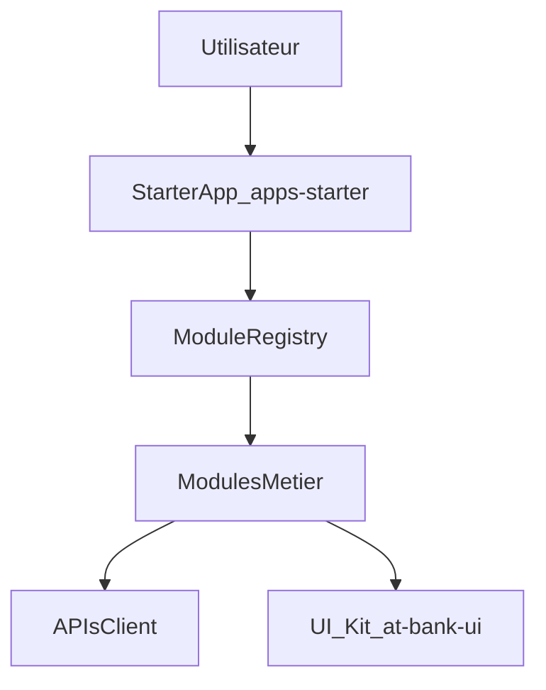

## Modular BankUI Studio – Vue d’ensemble Produit & Technique

### Qu’est‑ce que Modular BankUI Studio ?

Modular BankUI Studio est une **suite UI front‑end uniquement**, modulaire, pensée pour les back‑offices bancaires et environnements financiers.

- **100 % TypeScript** (`.ts` / `.tsx`) pour la robustesse et la maintenabilité.
- 100 % front‑end : aucun backend dans ce dépôt, vous branchez vos propres APIs.
- Modulaire : activation/désactivation de modules métier (Dashboard, Accounts, Transactions, Approvals, Users & Roles, Reports, Audit, et vos propres modules).
- Brandable : theming par client (logo, couleurs, tokens de design, config session et auth).
- Focalisé entreprise : RBAC, audit, timeout de session, durcissement sécurité (apiClient, sanitizeHtml), performance, accessibilité (WCAG 2.1 AA).

Le projet est conçu à la fois comme **vitrine architecturale** et comme **starter kit** pour des intégrations réelles en entreprise :

- architecture claire et modulaire,
- séparation nette des responsabilités,
- tests et documentation adaptés aux revues techniques (CTO, staff engineers, leads).

### Personas & utilisateurs cibles

#### 1. Développeurs d’intégration (front / back)

**Objectif** : forker ou réutiliser `apps/starter`, brancher les APIs existantes, ajouter ou adapter des modules métier.

Leurs priorités :

- comprendre le câblage des modules (`modules/registry.ts`, `client.config.json`, ConfigGate),
- savoir comment ajouter un module avec ses routes et sa navigation (contrat BankModule),
- implémenter et surcharger les adaptateurs d’API par client,
- garder un code testé, maintenable et compatible avec les contraintes IT (Vitest, Playwright, test:security).

#### 2. Équipes IT / Ops / Plateforme

**Objectif** : déployer, configurer et exploiter l’UI dans les environnements bancaires.

Leurs priorités :

- processus de build et de déploiement (assets statiques, reverse proxy / gateway),
- configuration par environnement (`client.config.json` par env),
- posture de sécurité (tokens, CSP, logs),
- observabilité et monitoring.

#### 3. Product owners & métiers

**Objectif** : comprendre ce que fait chaque module et comment il soutient les opérations bancaires.

Leurs priorités :

- savoir quels modules existent et quels problèmes ils adressent,
- voir comment l’UI s’adapte à leurs processus (rôles, workflows, branding),
- identifier ce qui reste côté backend et systèmes internes (conformité, KYC/AML, risques).

### Architecture haut niveau

Modular BankUI Studio fournit :

- une **starter app** `apps/starter` servant de démo et de base d’intégration,
- un **UI kit** réutilisable dans `packages/ui` exposé en `@bank/ui`,
- un **fichier de configuration client** `public/client.config.json` pour piloter branding, modules et paramètres d’API.

### Fonctionnement des modules

Chaque module métier expose un **contrat BankModule** (interface TypeScript dans `core/types.ts`) : `id`, `name`, `basePath`, `routes`, `sidebarItems`, `permissionsRequired?`, `featureFlags?`.

Le **registry** (`modules/registry.ts`) :

- centralise tous les modules connus (dashboard, accounts, transactions, approvals, users-roles, reports, audit),
- lit la config client (chargée et validée par ConfigGate) pour déterminer quels modules sont **activés**,
- expose `getEnabledModules(config?)`, `getSidebarItems(config, userPermissions)` et `canAccessModule(module, permissions)` pour le routeur et l’AppShell.

Conséquences :

- ajouter un module = créer un dossier, implémenter le contrat, l’enregistrer,
- activer/désactiver des modules par environnement ou par client,
- garder une navigation et un routing cohérents.

### Ce que vous pouvez personnaliser

- **Branding & thème** : nom, logo, couleur principale, tokens de design.
- **Modules** : activer/désactiver les modules fournis, ajouter les vôtres.
- **Adaptateurs d’API** : remplacer les adaptateurs REST génériques par des versions spécifiques client.
- **Contrôle d’accès** : intégrer votre IAM / IDP et brancher le RBAC au niveau des modules et des routes.
- **UX** : étendre ou remplacer les vues internes de chaque module en réutilisant le UI kit partagé.

### Où aller ensuite

- Pour l’installation et la mise en place de l’environnement, voir `getting-started.md`.
- Pour une vue détaillée de l’architecture, voir `architecture.md`.
- Pour les détails de chaque module fonctionnel, voir les fichiers sous `modules/`.
- Pour la configuration et les APIs, voir `configuration/client-config.md` et `configuration/api-adapters.md`.
- Pour la sécurité, l’accessibilité, la performance et les tests, voir les guides dédiés.
- Pour un parcours complet d’intégration en entreprise, voir `enterprise-integration-guide.md`.
