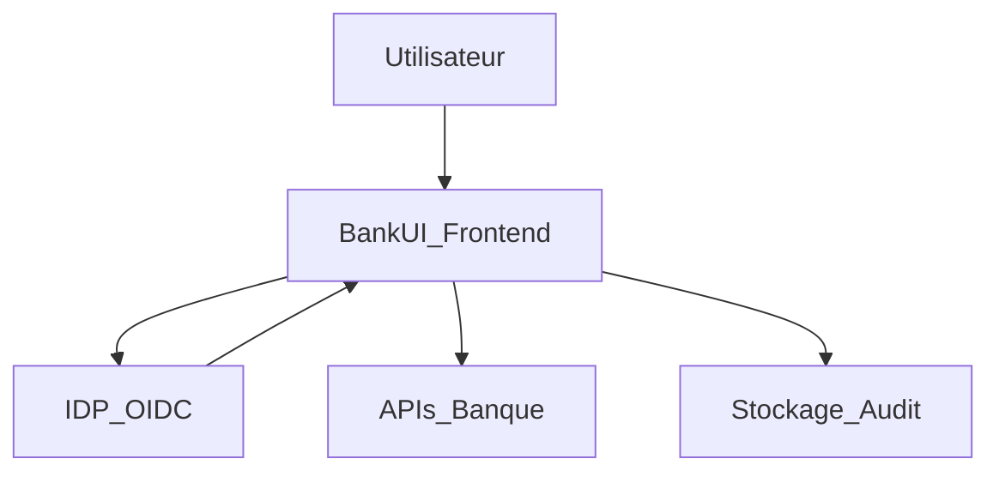

## Sécurité & Conformité

### Périmètre

Modular BankUI Studio est **front‑end uniquement** :  
les règles métier, la protection des données et la conformité réglementaire (KYC/AML, RGPD, etc.) restent côté backend.  
L’UI est conçue pour :

- ne pas introduire de nouvelles surfaces d’attaque,  
- appliquer de bonnes pratiques de sécurité côté client,  
- s’intégrer proprement à votre stack de sécurité existante.

### Principes de sécurité front

- **Tokens en mémoire uniquement** par défaut (pas de stockage long terme).  
- **CSP‑friendly** : compatible avec des politiques CSP strictes.  
- **RBAC** : routes et composants protégés par des guards de rôles/permissions.  
- **Pas de PII dans les logs** par défaut.  
- **Sanitization** de tout contenu riche (par ex. via DOMPurify).

### Architecture sécurité typique

Backends :

- authentifient les utilisateurs (IDP / IAM),  
- autorisent les actions (RBAC/ABAC côté APIs),  
- stockent toutes les données sensibles.

Frontend :

- utilise tokens ID / access pour appeler les APIs,  
- masque ou désactive l’UI selon les rôles/permissions.

### Checklist – intégration sécurisée

**Auth & sessions**

- [ ] Utiliser une librairie OIDC/OAuth maintenue.  
- [ ] Conserver les tokens en mémoire ou en stockage très court terme.  
- [ ] Implémenter les flux de logout / révocation de tokens.  
- [ ] Éviter de stocker des tokens sensibles en `localStorage` sans analyse de risque.

**Réseau & CSP**

- [ ] Forcer HTTPS partout.  
- [ ] Configurer CSP pour restreindre scripts, styles et connexions.  
- [ ] Restreindre les origines autorisées pour les APIs et l’IDP.

**Logs & analytics**

- [ ] Ne pas logger de PII côté front.  
- [ ] Utiliser des IDs de corrélation plutôt que des identifiants client.  
- [ ] Remonter les erreurs dans votre stack d’observabilité avec un contexte minimal.

**RBAC & guards**

- [ ] Définir un modèle de permissions clair (par module/action).  
- [ ] Utiliser des guards sur les routes et composants critiques.  
- [ ] Ne jamais se reposer uniquement sur le front ; toujours réappliquer les contrôles côté backend.

### Aspects conformité

L’UI peut contribuer à :

- la journalisation des accès et actions (via le module Audit),  
- la transparence vis‑à‑vis des utilisateurs (origine des données, etc.),  
- la séparation des tâches (combinaison modules + rôles).

La conformité réglementaire formelle reste hors du scope de ce dépôt et doit être adressée par vos backends et vos processus internes.

