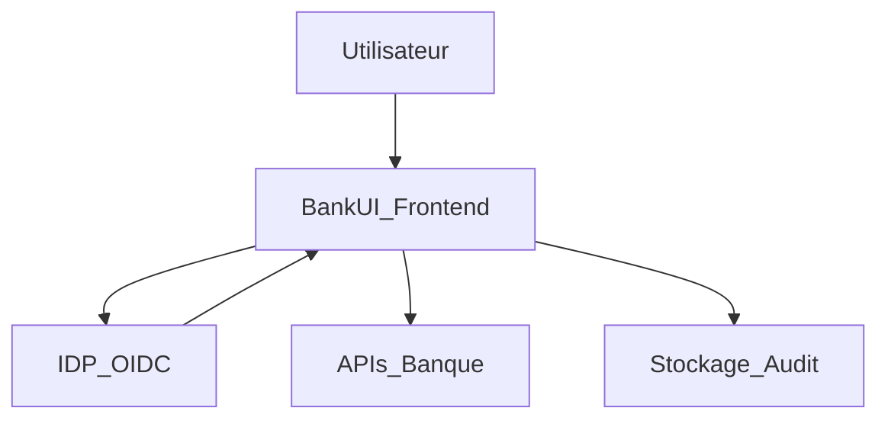

## Sécurité & Conformité

### Périmètre

Modular BankUI Studio est **front‑end uniquement** :  
les règles métier, la protection des données et la conformité réglementaire (KYC/AML, RGPD, etc.) restent côté backend.  
L’UI est conçue pour :

- ne pas introduire de nouvelles surfaces d’attaque,
- appliquer de bonnes pratiques de sécurité côté client,
- s’intégrer proprement à votre stack de sécurité existante.

### Principes de sécurité front

- **Tokens en mémoire uniquement** par défaut (pas de stockage long terme).
- **CSP‑friendly** : compatible avec des politiques CSP strictes.
- **RBAC** : routes et composants protégés par des guards de rôles/permissions.
- **Pas de PII dans les logs** : le module `lib/monitoring/logger` expose `logError`, `logBoundaryError` (ErrorBoundary) et `logApiError` (status + path uniquement). Aucun corps de requête, token ni donnée personnelle n’est envoyé. En production, le logger peut être branché sur un service (ex. Sentry) en conservant ces règles.
- **Sanitization** de tout contenu riche (par ex. via DOMPurify).

Dans l’app starter :

- une **CSP minimale** est définie dans `apps/starter/index.html` (meta `Content-Security-Policy`).
- un utilitaire `sanitizeHtml` et le composant `SafeHtml` encapsulent DOMPurify. **Tout** contenu HTML issu de la config, de l’API ou de l’utilisateur doit être rendu via `SafeHtml` (jamais de `dangerouslySetInnerHTML` sans sanitization).

### Architecture sécurité typique

Backends :

- authentifient les utilisateurs (IDP / IAM),
- autorisent les actions (RBAC/ABAC côté APIs),
- stockent toutes les données sensibles.

Frontend :

- utilise tokens ID / access pour appeler les APIs,
- masque ou désactive l’UI selon les rôles/permissions.

### Démo vs production

L’app starter inclut des **mécanismes réservés à la démo** (marqués en commentaires dans le code) :

- **Auth** : selon `auth.mode` dans `client.config.json` : `"demo"` utilise `AuthProvider` et `demoProfileStorage` (profil en `localStorage`) ; `"oidc"` utilise `OidcAuthProvider` (redirect IDP, tokens en mémoire via `memoryStore`).
- **RBAC** : les permissions sont dérivées côté client à partir du profil de démo.

En **production**, il faut :

- remplacer l’auth par un flux piloté par un **IDP** (OIDC, SAML) et des tokens ;
- faire appliquer le **RBAC côté backend** (chaque appel API doit être autorisé par le serveur) ;
- assurer l’**audit des actions** côté serveur (pas seulement via le module Audit front).

**Obligations explicites pour la production :**

- **Pas de profil ni de rôles dans `localStorage`** : le stockage `demo-profile` est strictement réservé à la démo. En production, l’authentification et les rôles doivent provenir d’un **IDP/backend** (tokens signés, session serveur). Ne jamais réutiliser ce mécanisme démo en prod.
- **Tokens d’accès en mémoire uniquement** : conserver les access tokens dans le contexte applicatif (ex. état React / mémoire), pas dans `localStorage` ni `sessionStorage`, pour limiter l’exposition en cas de XSS. Si des refresh tokens sont utilisés, les stocker de préférence en cookie httpOnly.
- **IDP/backend obligatoire** : l’app front ne doit pas décider seule des rôles ou permissions ; chaque appel métier sensible doit être autorisé par le backend.

Voir aussi `docs/security-hardening.md` et le guide d’intégration entreprise (`docs/fr/enterprise-integration-guide.md`).

### Checklist – intégration sécurisée

**Auth & sessions**

- [ ] Utiliser une librairie OIDC/OAuth maintenue.
- [ ] Conserver les tokens en mémoire ou en stockage très court terme.
- [ ] Implémenter les flux de logout / révocation de tokens.
- [ ] Éviter de stocker des tokens sensibles en `localStorage` sans analyse de risque.

**Réseau & CSP**

- [ ] Forcer HTTPS partout.
- [ ] Configurer CSP pour restreindre scripts, styles et connexions.
- [ ] Restreindre les origines autorisées pour les APIs et l’IDP.

**Logs & analytics**

- [ ] Ne pas logger de PII côté front.
- [ ] Utiliser des IDs de corrélation plutôt que des identifiants client.
- [ ] Remonter les erreurs dans votre stack d’observabilité avec un contexte minimal.

**RBAC & guards**

- [ ] Définir un modèle de permissions clair (par module/action).
- [ ] Utiliser des guards sur les routes et composants critiques.
- [ ] Ne jamais se reposer uniquement sur le front ; toujours réappliquer les contrôles côté backend.

### Aspects conformité

L’UI peut contribuer à :

- la journalisation des accès et actions (via le module Audit),
- la transparence vis‑à‑vis des utilisateurs (origine des données, etc.),
- la séparation des tâches (combinaison modules + rôles).

La conformité réglementaire formelle reste hors du scope de ce dépôt et doit être adressée par vos backends et vos processus internes.
