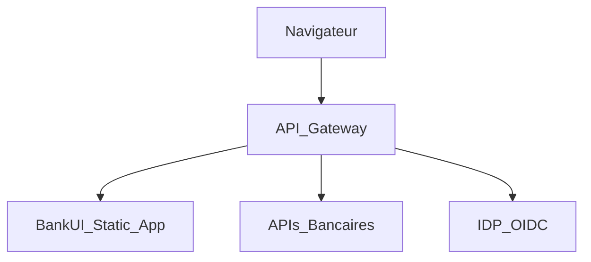

## Security hardening – Modular BankUI Studio

Ce document complète `docs/fr/security-compliance.md` avec des recommandations
très concrètes pour durcir le déploiement de l’UI en production.

### 1. En-têtes HTTP recommandés

À configurer sur votre reverse proxy / API gateway (NGINX, Traefik, etc.) :

- `Content-Security-Policy` (CSP) adaptée à votre contexte
- `X-Frame-Options: DENY` ou `SAMEORIGIN`
- `Referrer-Policy: strict-origin-when-cross-origin`
- `X-Content-Type-Options: nosniff`
- `Strict-Transport-Security` (HSTS) si vous forcez HTTPS

#### 1.1 CSP et style-src

Dans `apps/starter/index.html`, la meta CSP utilise `style-src 'self' 'unsafe-inline'` pour des raisons de compatibilité avec le build actuel (Tailwind / injection de styles courants sans nonce). En production, pour durcir :

- viser `style-src 'self'` avec **nonces** ou **hashes** si le pipeline de build les génère (voir [Vite CSP](https://vitejs.dev/guide/env-and-mode.html) et la doc de votre stack pour injecter un nonce par requête) ;
- tant que le build n’injecte pas de nonces, conserver `'unsafe-inline'` pour les styles afin d’éviter de casser le rendu ; la politique ci‑dessous reflète ce compromis.

#### 1.2 Exemple de CSP pour la gateway

Politique CSP stricte prête à l’emploi pour la gateway (à adapter selon vos origines API) :

```
default-src 'self'; script-src 'self'; style-src 'self' 'unsafe-inline'; img-src 'self' data:; connect-src 'self' https://api.example.com; frame-ancestors 'none'; base-uri 'self'; form-action 'self'
```

- **style-src** : `'unsafe-inline'` peut être retiré lorsque le build fournit des nonces ou des hashes pour les feuilles de style.
- **connect-src** : remplacer `https://api.example.com` par les origines API réelles (et l’IDP si besoin).
- Appliquer cette CSP en en-tête HTTP côté gateway en priorité ; la meta CSP dans `index.html` reste une couche minimale côté app.

### 2. Intégration typique derrière une gateway

L’app est servie comme un bundle statique derrière une gateway :



Points d’attention :

- restreindre les origines autorisées pour l’UI et les APIs ;
- centraliser la gestion TLS et les certificats côté gateway ;
- journaliser les erreurs front (via Sentry ou équivalent) avec un ID de corrélation.

### 3. Gestion des tokens et des sessions

- privilégier des librairies OIDC/OAuth maintenues ;
- conserver les tokens côté client en mémoire ou stockage court terme ;
- éviter `localStorage` pour les tokens sensibles sans analyse de risque ;
- toujours réappliquer les contrôles d’autorisation côté backend.

### 4. Durcissement de la configuration `client.config.json`

- valider systématiquement la config via le schéma partagé (`clientConfigSchema`) ;
- séparer les configs par environnement (dev/préprod/prod) et contrôler les diff ;
- préparer une procédure de rollback rapide en cas de config invalide.
