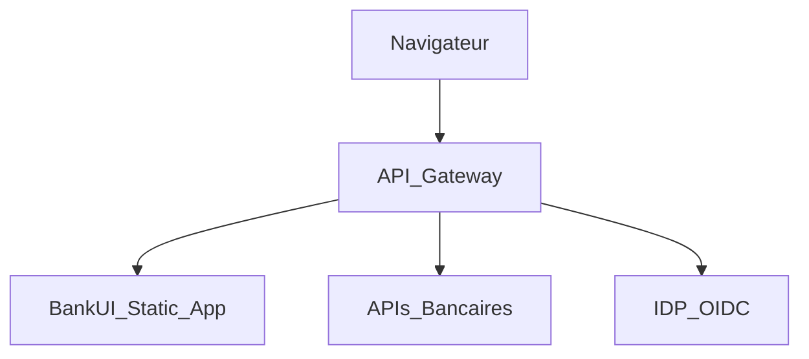

## Security hardening – Modular BankUI Studio

Ce document complète `docs/fr/security-compliance.md` avec des recommandations
très concrètes pour durcir le déploiement de l’UI en production.

### 1. En-têtes HTTP recommandés

À configurer sur votre reverse proxy / API gateway (NGINX, Traefik, etc.) :

- `Content-Security-Policy` (CSP) adaptée à votre contexte
- `X-Frame-Options: DENY` ou `SAMEORIGIN`
- `Referrer-Policy: strict-origin-when-cross-origin`
- `X-Content-Type-Options: nosniff`
- `Strict-Transport-Security` (HSTS) si vous forcez HTTPS

### 2. Intégration typique derrière une gateway

L’app est servie comme un bundle statique derrière une gateway :

Points d’attention :

- restreindre les origines autorisées pour l’UI et les APIs ;
- centraliser la gestion TLS et les certificats côté gateway ;
- journaliser les erreurs front (via Sentry ou équivalent) avec un ID de corrélation.

### 3. Gestion des tokens et des sessions

- privilégier des librairies OIDC/OAuth maintenues ;
- conserver les tokens côté client en mémoire ou stockage court terme ;
- éviter `localStorage` pour les tokens sensibles sans analyse de risque ;
- toujours réappliquer les contrôles d’autorisation côté backend.

### 4. Durcissement de la configuration `client.config.json`

- valider systématiquement la config via le schéma partagé (`clientConfigSchema`) ;
- séparer les configs par environnement (dev/préprod/prod) et contrôler les diff ;
- préparer une procédure de rollback rapide en cas de config invalide.

